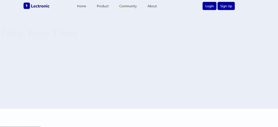

<a name="readme-top"></a>

[![Contributors][contributors-shield]][contributors-url]
[![Forks][forks-shield]][forks-url]
[![Issue][issues-shield]][issues-url]


<!-- PROJECT LOGO -->
<br />
<div align="center">
  <a href="https://lectronic.myvehicle-rent.site/">
    
  </a>

  <h3 align="center" style="color:#0300AD">Lectronic</h3>

  <p align="center">
    An awesome electronic market place website !
    <br />
    <br />
    <a href="https://lectronic.myvehicle-rent.site/">View Demo</a>
    ·
    <a href="https://github.com/wafellofazztrack">Report Bug</a>
    ·
    <a href="https://github.com/wafellofazztrack/Lectronic-Front-End">Request Feature</a>
  </p>
</div>


<!-- TABLE OF CONTENTS -->
<details>
  <summary>Table of Contents</summary>
  <ol>
    <li>
      <a href="#about-the-project">About The Project</a>
      <ul>
        <li><a href="#built-with">Built With</a></li>
      </ul>
    </li>
    <li>
      <a href="#getting-started">Getting Started</a>
      <ul>
        <li><a href="#prerequisites">Prerequisites</a></li>
        <li><a href="#installation">Installation</a></li>
      </ul>
    </li>
    <li><a href="#contributing">Contributing</a></li>
    <li><a href="#license">License</a></li>
    <li><a href="#contact">Contact</a></li>
  </ol>
</details>


<!-- ABOUT THE PROJECT -->
## About The Project

<div align="center">
  <a href="https://lectronic.myvehicle-rent.site/">
    
    </a>
</div>
<br/>
Lectronic is a marketplace-based website, which is specifically for selling electronic goods. For now, this project is still in the development stage.

Some of the features is has, including:
* Login/ Register
* Manage Product
* Add product
* Search and Sort

Of course this project still has many shortcomings, we hope to be able to complete the development of this project as soon as possible.


### Built With

This application is build by some tools and library, including:

* [![Npm][Npmjs]][npm-url]
* [![React][React.js]][React-url]
* [![Bootstrap][Bootstrap.com]][Bootstrap-url]
* [![Redux][redux]][redux-url]

<p align="right">(<a href="#readme-top">back to top</a>)</p>


<!-- GETTING STARTED -->
## Getting Started

This is an example of how you may give instructions on setting up your project locally.
To get a local copy up and running follow these simple example steps.

### Prerequisites

This is an example of how to list things you need to use the software and how to install them.
* npm
  ```sh
  npm install npm@latest -g
  ```

### Installation

_Follow the step bellow, for prepare the project_

1. Get a API from lectronic back-end project at [lectronic back-end](https://github.com/wafellofazztrack/lectronic-backend) and follow the step.
2. Clone the repo
   ```sh
   git clone https://github.com/wafellofazztrack/Lectronic-Front-End
   ```
3. Install NPM packages
   ```sh
   npm install
   ```
4. Enter your API in `env.local_example` and change file name to: `.env.local`;
   ```js
    REACT_APP_BASE_API_URL=https://yourlocalhost:yourport/
   ```

5. Now You All Set, you can run :
    ```sh
    npm start
    ```

<p align="right">(<a href="#readme-top">back to top</a>)</p>

<!-- CONTRIBUTING -->
## Contributing

Contributions are what make the open source community such an amazing place to learn, inspire, and create. Any contributions you make are **greatly appreciated**.

If you have a suggestion that would make this better, please fork the repo and create a pull request. You can also simply open an issue with the tag "enhancement".
Don't forget to give the project a star! Thanks again!

1. Fork the Project
2. Create your Feature Branch (`git checkout -b feature/AmazingFeature`)
3. Commit your Changes (`git commit -m 'Add some AmazingFeature'`)
4. Push to the Branch (`git push origin feature/AmazingFeature`)
5. Open a Pull Request

<p align="right">(<a href="#readme-top">back to top</a>)</p>


<!-- LICENSE -->
## License

Distributed under the MIT License. See `LICENSE.txt` for more information.

<p align="right">(<a href="#readme-top">back to top</a>)</p>


<!-- CONTACT -->
## Contact

Muhammad Angga Ardhinata - [@Linkedin](https://www.linkedin.com/in/anggaardhinata/) - ardhinataangga@gmail.com
Project Link: [https://github.com/AnggaArdhinata](https://github.com/AnggaArdhinata)

Rizaldi Fauzi - [@Linkedin](https://www.linkedin.com/in/rfauzi44/) - rizaldifauzi44@gmail.com
Project Link: [https://github.com/rfauzi44](https://github.com/rfauzi44)

Ahmad Syaifudin Ardhiansyah - [@Linkedin](https://www.linkedin.com/in/ardhisaif/) - ahmadsaifudinardhiansyah@gmail.com
Project Link: [https://github.com/ardhisaif](https://github.com/ardhisaif)

<p align="right">(<a href="#readme-top">back to top</a>)</p>


<!-- MARKDOWN LINKS & IMAGES -->
<!-- https://www.markdownguide.org/basic-syntax/#reference-style-links -->
[contributors-shield]: https://img.shields.io/github/contributors/wafellofazztrack/Lectronic-Front-End?style=for-the-badge
[contributors-url]: https://github.com/wafellofazztrack/Lectronic-Front-End/graphs/contributors
[forks-shield]: https://img.shields.io/github/forks/wafellofazztrack/Lectronic-Front-End.svg?style=for-the-badge
[forks-url]: https://github.com/wafellofazztrack/Lectronic-Front-End/network/members
[issues-shield]: https://img.shields.io/github/issues/wafellofazztrack/Lectronic-Front-End.svg?style=for-the-badge
[issues-url]: https://github.com/wafellofazztrack/Lectronic-Front-End/issues
[license-shield]: https://img.shields.io/github/license/othneildrew/Best-README-Template.svg?style=for-the-badge
[license-url]: https://github.com/othneildrew/Best-README-Template/blob/master/LICENSE.txt
[linkedin-shield]: https://img.shields.io/badge/-LinkedIn-black.svg?style=for-the-badge&logo=linkedin&colorB=555
[linkedin-url]: https://linkedin.com/in/othneildrew
[product-screenshot]: ./image/screnshootgif.gif
[Npmjs]: https://img.shields.io/badge/npm-555555?style=for-the-badge&logo=npm&logoColor=red
[npm-url]: https://www.npmjs.com/
[React.js]: https://img.shields.io/badge/React-20232A?style=for-the-badge&logo=react&logoColor=61DAFB
[React-url]: https://reactjs.org/
[Bootstrap.com]: https://img.shields.io/badge/Bootstrap-563D7C?style=for-the-badge&logo=bootstrap&logoColor=white
[Bootstrap-url]: https://getbootstrap.com
[redux]: https://img.shields.io/badge/Redux-563D7C?style=for-the-badge&logo=REDUX&logoColor=white
[redux-url]: https://redux.js.org/
